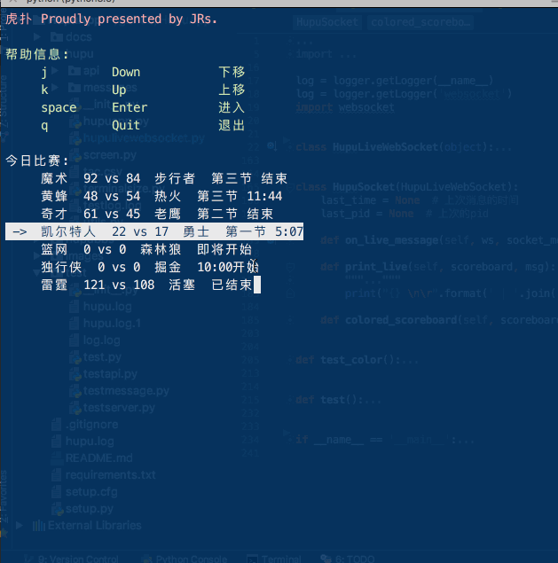
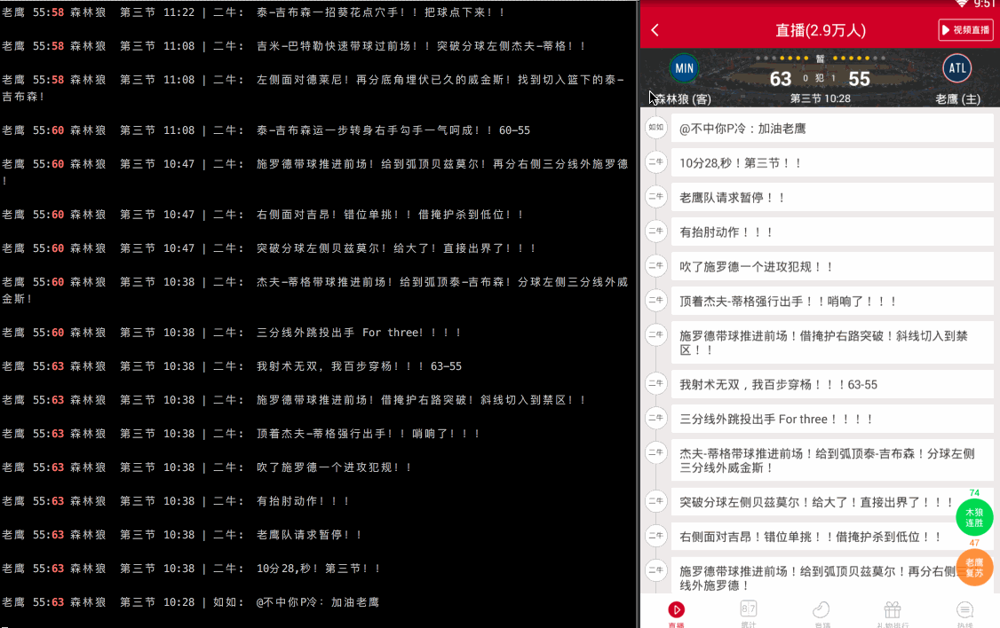
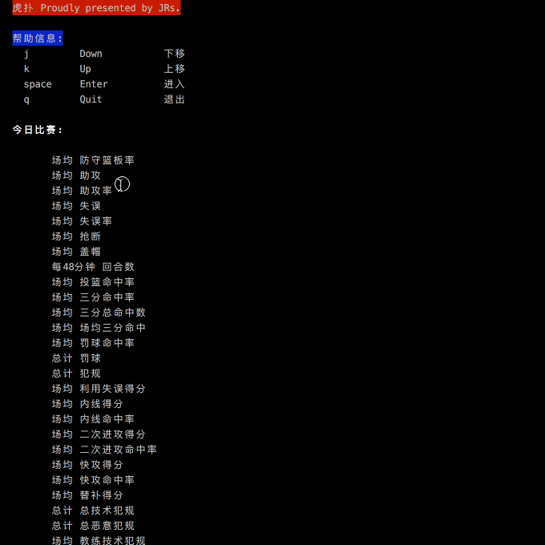
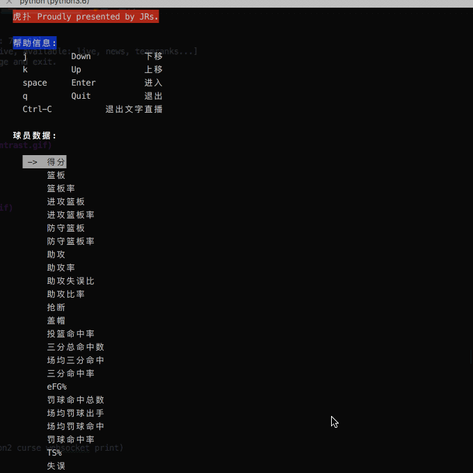
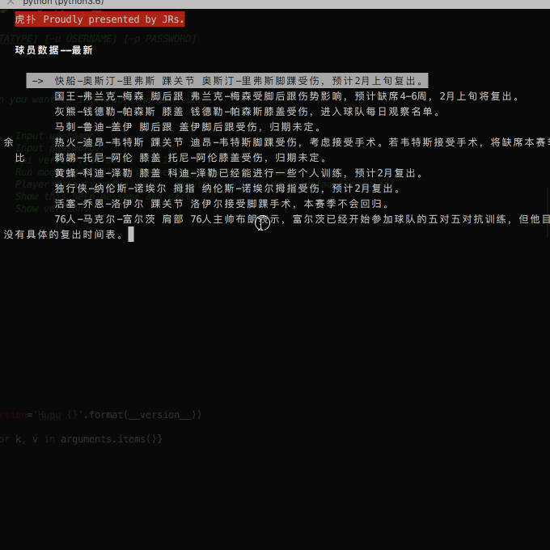
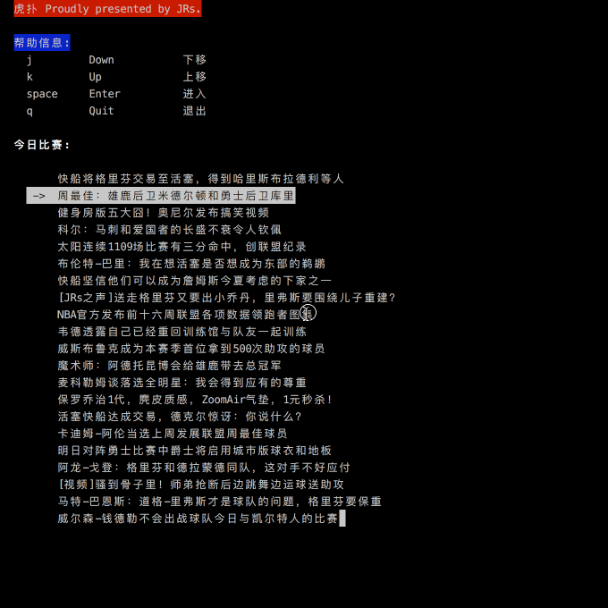

# 虎扑篮球命令行版  


灵感来自另一位[JR](https://github.com/chenjiandongx/HupuLive), 本来想fork他的工程继续改的,但是发现自己都没用到他的代码。所以就自己新建一个项目了.

目前大部分功能支持python3.x， python2.x, 部分功能python2.x的适配还在加油中...

### 测试环境
* macos 10.12.6
* Python 3.6.1 

## requirements

```
curses
docopt==0.6.2
requests==2.18.4
six>=1.10.0
colored==1.3.5
user-agent==0.1.9
websocket-client==0.46.0
future==0.16.0
```

## 安装

推荐使用 pip 进行安装
```
pip install HupuApp
```
安装完成后命令行直接运行`HupuApp`

## 使用指南
```shell
"""Hupu.
    Proudly presented by Hupu JRs.

Usage:
    hupu [-m MODE] [-a APIVERSION] [-d DATATYPE] [-u USERNAME] [-p PASSWORD]
    hupu -h | --help
    hupu -v | --version

Tips:
    Please hit Ctrl-C on the keyborad when you want to interrupt the game live.

Options:
    -u USERNAME --username=USERNAME         Input username.
    -p PASSWORD --password=PASSWORD         Input password.
    -a APIVERSION --apiversion=APIVERSION   Api version.[default: 7.1.15]
    -m MODE --mode=MODE                     Run mode.Available: live news teamranks...[default: live]
    -d DATATYPE --datatype=DATATYPE         Player data type.Available: regular, injury, daily.[default:regular]
    -h --help                               Show this help message and exit.
    -v --version                            Show version.
"""
```

## 虎扑直播





## 球队数据排行




## 球员数据






## 虎扑新闻




## To-do list
* [x] http接口get, post, 参数规则
* [x] 获取比赛列表
* [x] 获取直播文字历史记录
* [x] 命令行界面的设计
* [ ] 框架的设计, 绝对可以改进
* [ ] websocket的研究
* [x] 直播数据tcp的连接
* [x] package 的 import 问题
* [x] 心跳延续的问题
* [x] curses 熟悉
* [ ] 新闻的显示问题
* [ ] python2, python3的兼容问题(主要为python2 curse websocket print)
* [x] ip地址列表的获取
