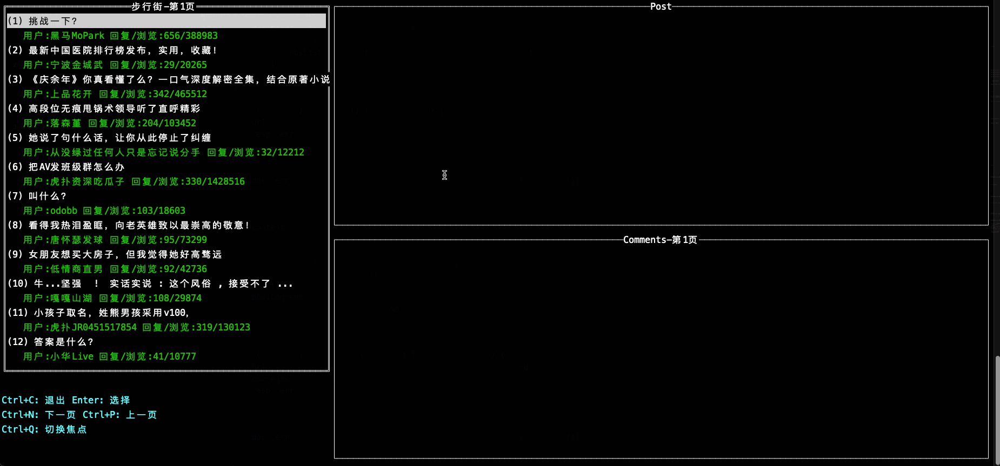

# 虎扑篮球命令行版  


灵感来自另一位[JR](https://github.com/chenjiandongx/HupuLive), 本来想fork他的工程继续改的,但是发现自己都没用到他的代码。所以就自己新建一个项目了.

~~目前大部分功能支持python3.x， python2.x, 部分功能python2.x的适配还在加油中...~~

~~window的适配也在努力中...~~

# go 版本的架构

- cmd 入口
- gohupu
  - api
    - live.go 直播接口
    - base.go 接口基础
  - message
    - ~~ws.go   websocket消息~~
    - http.go http消息
  - live
    - client.go 直播客户端
  - menu
    - base.go   基础
    - live.go   直播菜单
  - logger  日志
- constant.go  常量，设置等
- utils.go     公用方法

### 测试环境

- go version go1.16.4 windows/amd64

## 安装

在[release](https://github.com/wudizhangzhi/HupuApp/releases)页面中选择符合自己系统版本的下载，
解压缩后进入文件夹直接执行`./hupu`

## 使用指南

```bash
Usage: Hupu <command>

A command line tool for Hupu.

Commands:
  live            比赛直播.
    <gameType>    比赛类型(nba/cba).

  news            新闻、帖子.
    <region>      领域(nba/cba/湿乎乎/步行街).

Flags:
  -h, --help     Show context-sensitive help.
      --debug    Enable debug mode.

Run "Hupu <command> --help" for more information on a command.
```

方向键上下控制选项，回车选择，ctrl+c中途退出。

## 虎扑直播

```bash
Hupu live nba
```


## 虎扑新闻

```bash
Hupu news 步行街
```



## To-do list

- [ ] go版本其他功能(新闻，数据等)
  - [x] 新闻
  - [ ] 数据
